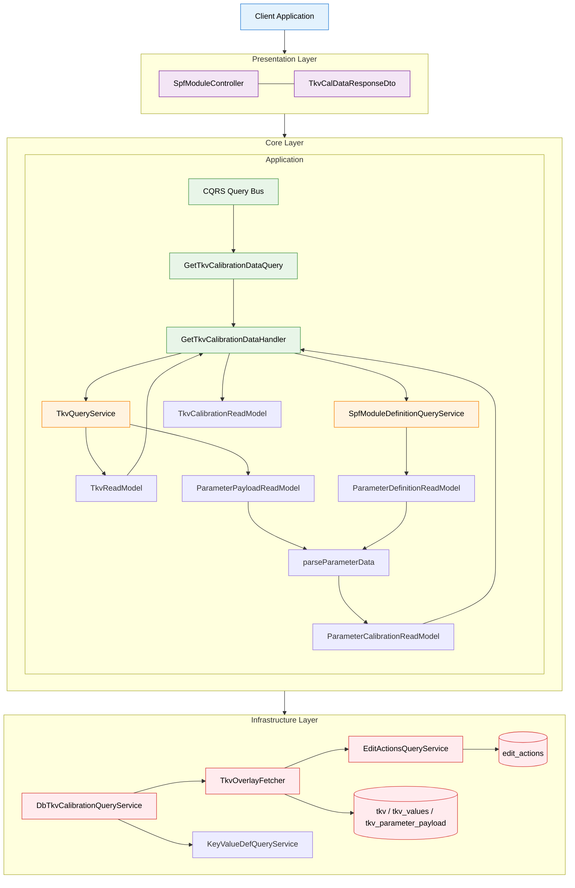
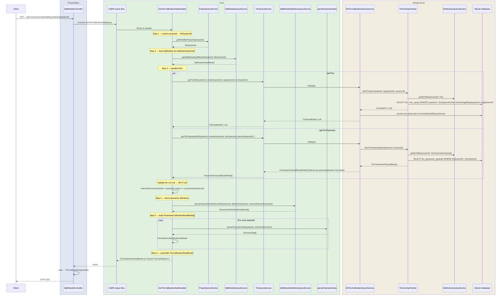
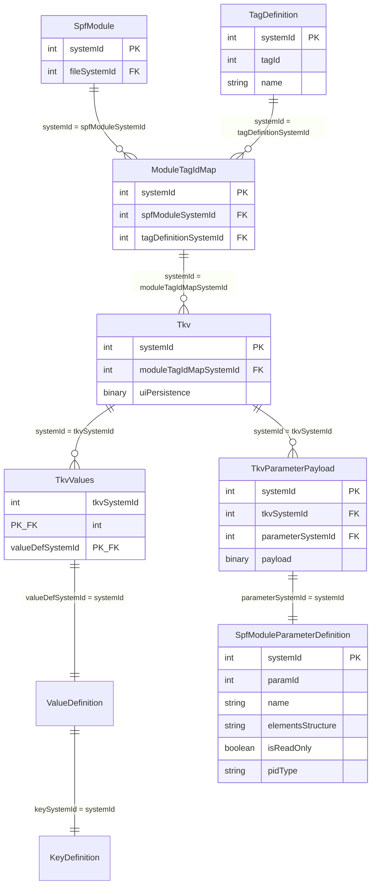

# SPF Module Get TKV Tag Data — Low-Level Design

## Table of Contents

- [Overview](#overview)
- [High-Level Architecture Diagram](#high-level-architecture-diagram)
- [File and Folder Organization](#file-and-folder-organization)
  - [Presentation Layer Files](#presentation-layer-files)
  - [Core Layer Files](#core-layer-files)
  - [Infrastructure Layer Files](#infrastructure-layer-files)
- [End-to-End Workflow](#end-to-end-workflow)
  - [Call Flow Summary](#call-flow-summary)
  - [Sequence Diagram](#sequence-diagram)
- [Layer-by-Layer Design](#layer-by-layer-design)
  - [1. Presentation Layer](#1-presentation-layer)
  - [2. Core Layer](#2-core-layer)
    - [2.1 CQRS: Query and Handler](#21-cqrs-query-and-handler)
    - [2.2 TKV Calibration Read Models](#22-tkv-calibration-read-models)
    - [2.3 TkvQueryService Interface](#23-tkvqueryservice-interface)
    - [2.4 Binary Parser (existing — reused)](#24-binary-parser-existing--reused)
  - [3. Infrastructure Layer](#3-infrastructure-layer)
    - [3.1 DB Schema Relationships](#31-db-schema-relationships)
    - [3.2 TkvOverlayFetcher — fetchTkv Addition](#32-tkvoverlayfetcher--fetchtkv-addition)
    - [3.3 DbTkvCalibrationQueryService](#33-dbtkvCalibrationqueryservice)
    - [3.4 Data Transformation Pipeline](#34-data-transformation-pipeline)
- [Testing Strategy](#testing-strategy)
  - [Unit Tests](#unit-tests)
  - [Integration Tests](#integration-tests)
  - [End-to-End Tests](#end-to-end-tests)

---

## Overview

This document describes the design of the RESTful GET endpoint for retrieving SPF module TKV tag data.
It is the TKV counterpart of `spf-module-get-ckv-calibration-design.md` — the same binary-parsing,
session-overlay, and CQRS structure applies; the key differences are the extra `tagSystemId` path
parameter and the TKV-specific DB tables and overlay aggregate IDs.

**Endpoint:** `GET /arc-api/v1/projects/{projectId}/spf-modules/{spfModuleSystemId}/tag-data/{tagSystemId}/{tkvSystemId}`

**Reference design:** `docs/spf-module-get-ckv-calibration-design.md` — identical patterns apply unless stated otherwise.

---

## High-Level Architecture Diagram



---

## File and Folder Organization

### Presentation Layer Files

```
packages/api/src/presentation/rest/modules/spf-module/
└── spf-module.controller.ts                      (existing — getTagData implemented)
```

### Core Layer Files

```
packages/core/src/application/
├── ports/persistence/query-services/
│   └── spf-module/
│       ├── spf-module-query-service.ts            (modified — add tkvQueryService property)
│       └── tkv/
│           ├── tkv-query-service.ts               (new — TkvQueryService interface)
│           └── tkv-read-model.ts                  (new — TkvParameterPayloadReadModel alias)
└── usecase-designer/spf-module/
    └── get-tag-data/
        ├── get-tkv-cal-data.query.ts              (new — GetTkvCalibrationDataQuery)
        ├── get-tkv-cal-data.handler.ts            (new — GetTkvCalibrationDataHandler)
        ├── tkv-calibration-read-model.ts          (new — ParameterCalibrationReadModel + TkvCalibrationReadModel)
        └── tkv-cal-data-dto.ts                    (existing — TkvCalDataDtoSchema; add mapTkvCalDataDto)
```

`get-tag-data/` already exists (contains `tkv-cal-data-dto.ts`).

**Query handler registration:**
```
packages/core/src/application/orchestration/cqrs/registries/
└── query-handler-registry.ts                      (modified — register GetTkvCalibrationDataHandler)
```

### Infrastructure Layer Files

```
packages/infrastructure/persistence/src/persistence-typeorm-sqllite/
├── fetchers/
│   └── tkv-overlay-fetcher.ts                    (modified — add fetchTkv method)
└── queries/
    └── module-calibration/
        └── db-tkv-calibration-query-service.ts   (new — DbTkvCalibrationQueryService)
```

**Wiring:**
```
packages/infrastructure/persistence/src/persistence-typeorm-sqllite/
└── queries/typeorm-query-services.ts             (modified — wire DbTkvCalibrationQueryService into DbSpfModuleQueryService)
```

---

## End-to-End Workflow

### Call Flow Summary

1. Controller validates path/query params and dispatches `GetTkvCalibrationDataQuery`.
2. Handler resolves `projectId` → `fileSystemId` and loads `SpfModuleReadModel` (for `definitionSystemId`).
3. Handler fetches in parallel: TKV row (key-value pairs) + TKV parameter payloads.
4. Handler fetches parameter definitions (filtered to the FK values from the payload rows).
5. Handler joins payloads + definitions, decodes binary via `parseParameterData`, builds `ParameterCalibrationReadModel[]`.
6. Handler assembles `TkvCalibrationReadModel` and returns it.
7. Controller maps to `TkvCalDataResponseDto` and returns HTTP 200.

### Sequence Diagram



---

## Layer-by-Layer Design

### 1. Presentation Layer

**File:** `packages/api/src/presentation/rest/modules/spf-module/spf-module.controller.ts` (existing — implement `getTagData`)

The controller stub already exists. Implementation mirrors `getCalibrationData` exactly:
- Constructs `GetTkvCalibrationDataQuery(projectId, spfModuleSystemId, tagSystemId, tkvSystemId, clientId, paramSystemIds?)`
- Dispatches via `queryBus`
- Returns `toApiResult(result)` → `ApiResult<TkvCalDataResponseDto>`

No DTO transformation in the controller — `TkvCalDataResponseDto` wraps `TkvCalDataDtoSchema` which is already the output shape of the handler.

```typescript
@Get('/:spfModuleSystemId/tag-data/:tagSystemId/:tkvSystemId')
async getTagData(
  @Param('projectId') projectId: string,
  @Param('spfModuleSystemId') spfModuleSystemId: string,
  @Param('tagSystemId') tagSystemId: string,
  @Param('tkvSystemId') tkvSystemId: string,
  @Query('param-system-ids') paramSystemIds?: string,
): Promise<ApiResult<TkvCalDataResponseDto>> {
  const clientId = 'client-id'; // TODO: extract from JWT
  const query = new GetTkvCalibrationDataQuery(
    projectId, spfModuleSystemId, tagSystemId, tkvSystemId, clientId, paramSystemIds,
  );
  const result = await this.queryBus.execute<Result<TkvCalDataDto>>(query);
  return toApiResult(result);
}
```

### 2. Core Layer

#### 2.1 CQRS: Query and Handler

**File:** `packages/core/src/application/usecase-designer/spf-module/get-tag-data/get-tkv-cal-data.query.ts` (new)

Mirrors `GetCkvCalibrationDataQuery` exactly, with an additional `tagSystemId` field.

```typescript
export class GetTkvCalibrationDataQuery extends BaseQuery {
  public readonly projectId: number;
  public readonly spfModuleSystemId: number;
  /** moduleTagIdMapSystemId — identifies the tag bin. */
  public readonly tagSystemId: number;
  public readonly tkvSystemId: number;
  /** PKs of tkv_parameter_payload rows. Empty = all payloads under the TKV. */
  public readonly paramSystemIds: number[];

  constructor(
    projectIdStr: string,
    spfModuleSystemIdStr: string,
    tagSystemIdStr: string,
    tkvSystemIdStr: string,
    clientId: string,
    paramSystemIdsStr?: string,
  ) {
    super(clientId);
    this.projectId       = parseId(projectIdStr, 'projectId');
    this.spfModuleSystemId = parseId(spfModuleSystemIdStr, 'spfModuleSystemId');
    this.tagSystemId     = parseId(tagSystemIdStr, 'tagSystemId');
    this.tkvSystemId     = parseId(tkvSystemIdStr, 'tkvSystemId');
    this.paramSystemIds  = paramSystemIdsStr
      ? paramSystemIdsStr.split(',').map(id => parseId(id.trim(), 'param-system-ids'))
      : [];
  }
}
```

**File:** `packages/core/src/application/usecase-designer/spf-module/get-tag-data/get-tkv-cal-data.handler.ts` (new)

`GetTkvCalibrationDataHandler` is structurally identical to `GetCkvCalibrationDataHandler` (`get-ckv-cal-data.handler.ts`). The only differences:
- Uses `queryServices.spfModuleQueryService.tkvQueryService` instead of `ckvQueryService`
- Passes `query.tagSystemId` to `getTkv()`
- Calls `mapTkvCalDataDto()` (TKV-specific mapper)

```typescript
export class GetTkvCalibrationDataHandler implements QueryHandler<
  GetTkvCalibrationDataQuery,
  Promise<Result<TkvCalDataDto>>
> {
  constructor(
    private readonly queryServices: QueryServices,
    private readonly logger?: Logger,
  ) {}

  async handle(query: GetTkvCalibrationDataQuery): Promise<Result<TkvCalDataDto>> {
    const fileSystemId = await this.queryServices.projectQueryService
      .getFileIdByProjectId(query.projectId);

    // Load SpfModule to get definitionSystemId for parameter definition lookup
    const spfModuleResult = await this.queryServices.spfModuleQueryService
      .getSpfModule(query.spfModuleSystemId, fileSystemId);
    if (spfModuleResult.kind === RESULT_KIND.Fail) {
      throw new ResourceNotFoundException(`SpfModule ${query.spfModuleSystemId} not found`, spfModuleResult.issues);
    }
    const spfModule = spfModuleResult.data;

    // Parallel fetch: TKV row + payload rows
    const [tkv, payloads] = await Promise.all([
      this.queryServices.spfModuleQueryService.tkvQueryService.getTkv(
        fileSystemId, query.spfModuleSystemId, query.tagSystemId, query.tkvSystemId,
      ),
      this.queryServices.spfModuleQueryService.tkvQueryService.getTkvPayloads(
        fileSystemId, query.spfModuleSystemId, query.tkvSystemId, query.paramSystemIds,
      ),
    ]);

    if (!tkv) {
      throw new ResourceNotFoundException(`Tkv with systemId ${query.tkvSystemId} not found`);
    }

    const relevantParamSystemIds = payloads.map(p => p.parameterSystemId);
    const parameterDefinitions = await this.queryServices.spfModuleDefinitionQueryService
      .queryParameterDefinitions(fileSystemId, spfModule.definitionSystemId, relevantParamSystemIds);

    // Report missing param-system-ids as partial issues
    const missingParamSystemIds = query.paramSystemIds.length > 0
      ? (() => {
          const returnedIds = new Set(payloads.map(p => p.systemId));
          return query.paramSystemIds.filter(id => !returnedIds.has(id));
        })()
      : undefined;

    const parameters = this.buildParameterDataModels(payloads, parameterDefinitions);
    const dto = mapTkvCalDataDto(tkv, parameters);

    if (missingParamSystemIds && missingParamSystemIds.length > 0) {
      const issues = missingParamSystemIds.map(id => ({
        code: ISSUE_CODE.PARAM_PAYLOAD_NOT_FOUND,
        message: `No tag data payload found for parameter system ID ${id}`,
        severity: IssueSeverity.Error,
      }));
      return Result.partial(dto, issues);
    }

    return Result.ok(dto);
  }

  // Identical to GetCkvCalibrationDataHandler.buildParameterDataModels
  private buildParameterDataModels(
    payloads: ParameterPayloadReadModel[],
    definitions: ParameterDefinitionReadModel[],
  ): ParameterCalibrationReadModel[] { /* same implementation */ }
}
```

> **Note:** `buildParameterDataModels` is identical to the CKV handler. Consider extracting it to a shared utility in `spf-module/shared/` if desired — but do NOT do this speculatively; extract only if a third consumer arises.

#### 2.2 TKV Calibration Read Models

**File:** `packages/core/src/application/usecase-designer/spf-module/get-tag-data/tkv-calibration-read-model.ts` (new)

```typescript
import type {ParameterCalibrationReadModel} from '../get-cal-data/ckv-calibration-read-model.js';
import type {TkvReadModel} from '../../../ports/persistence/query-services/spf-module/tuning/tuning-config-read-model.js';

export type {ParameterCalibrationReadModel};  // re-export — TKV uses the same type

export interface TkvCalibrationReadModel {
  tkv: TkvReadModel;
  parameters: ParameterCalibrationReadModel[];
}
```

`ParameterCalibrationReadModel` is defined in `get-cal-data/ckv-calibration-read-model.ts` and is reused unchanged — it is a generic merged payload+definition type, not CKV-specific.

**File:** `packages/core/src/application/usecase-designer/spf-module/get-tag-data/tkv-cal-data-dto.ts` (existing — add `mapTkvCalDataDto`)

The `TkvCalDataDtoSchema` already exists. Add the mapper function:

```typescript
export function mapTkvCalDataDto(
  tkv: TkvReadModel,
  parameters: ParameterCalibrationReadModel[],
): TkvCalDataDto {
  return {
    systemId: tkv.systemId.toString(),
    Tkv: (tkv.keyValuePairs ?? []).map(kv => ({
      key: {
        keyId: kv.key.keyId,
        name: kv.key.name,
        systemId: String(kv.key.systemId),
      },
      value: {
        valueId: kv.value.valueId,
        name: kv.value.name,
        systemId: String(kv.value.systemId),
      },
    })),
    parameters: parameters.map(p => mapParameterCalibrationToDto(p)),
  };
}
```

`mapParameterCalibrationToDto` is imported from `get-cal-data/ckv-cal-data-dto.ts` (already exported there) — reused unchanged.

#### 2.3 TkvQueryService Interface

**File:** `packages/core/src/application/ports/persistence/query-services/spf-module/tkv/tkv-query-service.ts` (new)

```typescript
import type {TkvReadModel} from '../tuning/tuning-config-read-model.js';
import type {ParameterPayloadReadModel} from '../ckv/ckv-read-model.js';

export interface TkvQueryService {
  /**
   * Returns the TKV row with its key-value pairs for the given TKV,
   * scoped to the owning tag map (moduleTagIdMapSystemId = tagSystemId).
   * Returns null if not found or deleted in the active session.
   */
  getTkv(
    fileSystemId: number,
    moduleSystemId: number,
    moduleTagIdMapSystemId: number,
    tkvSystemId: number,
  ): Promise<TkvReadModel | null>;

  /**
   * Returns TKV parameter payload rows for the given TKV.
   * When paramSystemIds is non-empty, filters to those payload PKs.
   * When empty, returns all payloads under the TKV.
   * Overlay-aware via TkvOverlayFetcher.
   */
  getTkvPayloads(
    fileSystemId: number,
    moduleSystemId: number,
    tkvSystemId: number,
    paramSystemIds?: number[],
  ): Promise<ParameterPayloadReadModel[]>;
}
```

`ParameterPayloadReadModel` is reused from `ckv/ckv-read-model.ts` — the TKV payload row has the same three fields (`systemId`, `parameterSystemId`, `payload`).

**File:** `packages/core/src/application/ports/persistence/query-services/spf-module/spf-module-query-service.ts` (modified)

Add one line:

```typescript
export interface SpfModuleQueryService {
  readonly ckvQueryService: CkvQueryService;
  readonly tkvQueryService: TkvQueryService;  // ← new
  // ...existing methods unchanged
}
```

#### 2.4 Binary Parser (existing — reused)

`parseParameterData`, `BinaryDataReader`, and `evaluateFormula` are unchanged. The TKV handler calls them identically to the CKV handler. See `spf-module-get-ckv-calibration-design.md` § 2.5 for the full specification.

---

### 3. Infrastructure Layer

#### 3.1 DB Schema Relationships



**Aggregate IDs in `edit_actions`:**
| Table | `aggregateId` |
|---|---|
| `module_tag_id_map` | `moduleSystemId` (SpfModule PK) |
| `tkv` | `moduleTagIdMapSystemId` |
| `tkv_parameter_payload` | matched by `tkvSystemId` in `newValue` |

#### 3.2 TkvOverlayFetcher — `fetchTkv` Addition

**File:** `packages/infrastructure/persistence/src/persistence-typeorm-sqllite/fetchers/tkv-overlay-fetcher.ts` (modified)

Add `fetchTkv` — the single-TKV equivalent of `CkvOverlayFetcher.fetchCkv`:

```typescript
/**
 * Returns the overlaid Tkv row for the given tkvSystemId, scoped to
 * moduleTagIdMapSystemId (validates ownership).
 * Returns null if not found or deleted in the active session.
 *
 * Overlay uses aggregateId = moduleTagIdMapSystemId (same as fetchForModule
 * per-tag map TKV overlay — the TKV's parent is the tag map, not the module).
 */
async fetchTkv(
  tkvSystemId: number,
  moduleTagIdMapSystemId: number,
  sessionId: number | null,
): Promise<OverlaidTkv | null> {
  const baseRow = (await this.manager
    .getRepository(ENTITY_NAMES.Tkv)
    .createQueryBuilder('tkv')
    .leftJoinAndSelect('tkv.values', 'tkvValues')
    .where('tkv.systemId = :tkvSystemId', {tkvSystemId})
    .andWhere('tkv.moduleTagIdMapSystemId = :moduleTagIdMapSystemId', {moduleTagIdMapSystemId})
    .getOne()) as TkvRow | null;

  if (sessionId === null) {
    return baseRow ? this.toOverlaidTkv(baseRow) : null;
  }

  // Tkv overlay uses moduleTagIdMapSystemId as aggregateId
  const tkvActions = await this.editActionsSvc.getByTable(sessionId, ENTITY_NAMES.Tkv);
  const relevantActions = tkvActions.filter(
    a => a.aggregateId === moduleTagIdMapSystemId &&
         (a.targetSystemId === tkvSystemId || a.operation === CHANGE_OPERATION.Create),
  );

  if (relevantActions.length === 0) {
    return baseRow ? this.toOverlaidTkv(baseRow) : null;
  }

  // Apply UPDATE/DELETE overlay to base row
  const deleteAction = relevantActions.find(
    a => a.operation === CHANGE_OPERATION.Delete && a.targetSystemId === tkvSystemId,
  );
  if (deleteAction) return null;

  if (baseRow) {
    const overlaid = this.overlay.applyToSingle(baseRow, relevantActions
      .filter(a => a.operation === CHANGE_OPERATION.Update && a.targetSystemId === tkvSystemId));
    return overlaid ? this.toOverlaidTkv(overlaid as TkvRow) : null;
  }

  // Handle CREATE (TKV created in session, not yet in DB)
  const createAction = relevantActions.find(
    a => a.operation === CHANGE_OPERATION.Create && a.targetSystemId === tkvSystemId,
  );
  if (createAction) {
    const p = createAction.newValue as Partial<TkvRow>;
    return {
      systemId: tkvSystemId,
      moduleTagIdMapSystemId: p.moduleTagIdMapSystemId ?? moduleTagIdMapSystemId,
      uiPersistence: null,
      values: [],
    };
  }

  return null;
}

private toOverlaidTkv(r: TkvRow): OverlaidTkv {
  return {...r, values: r.values ?? []};
}
```

> **Note:** `fetchTkvPayloads` already exists and is reused unchanged. The `paramSystemIds` filter is applied at the `DbTkvCalibrationQueryService` layer rather than inside the fetcher, to keep the fetcher lean.

#### 3.3 DbTkvCalibrationQueryService

**File:** `packages/infrastructure/persistence/src/persistence-typeorm-sqllite/queries/module-calibration/db-tkv-calibration-query-service.ts` (new)

Mirrors `DbCkvCalibrationQueryService` exactly, substituting TKV-specific types and calls.

```typescript
export class DbTkvCalibrationQueryService implements TkvQueryService {
  constructor(
    private readonly manager: EntityManager,
    editActionsQueryService: EditActionsQueryService,
    private readonly keyValueDefQueryService: KeyValueDefQueryService,
  ) {
    this.tkvFetcher = new TkvOverlayFetcher(manager, editActionsQueryService);
  }

  async getTkv(
    fileSystemId: number,
    moduleSystemId: number,
    moduleTagIdMapSystemId: number,
    tkvSystemId: number,
  ): Promise<TkvReadModel | null> {
    const sessionId = await resolveActiveSessionId(this.dataSource, fileSystemId);
    const overlaid = await this.tkvFetcher.fetchTkv(tkvSystemId, moduleTagIdMapSystemId, sessionId);
    return overlaid ? this.transformToTkvReadModel(overlaid, fileSystemId) : null;
  }

  async getTkvPayloads(
    fileSystemId: number,
    moduleSystemId: number,
    tkvSystemId: number,
    paramSystemIds?: number[],
  ): Promise<ParameterPayloadReadModel[]> {
    const sessionId = await resolveActiveSessionId(this.dataSource, fileSystemId);
    const all = await this.tkvFetcher.fetchTkvPayloads(tkvSystemId, sessionId);
    // Filter by paramSystemIds (payload PKs) at service layer
    const filtered = paramSystemIds && paramSystemIds.length > 0
      ? all.filter(p => paramSystemIds.includes(p.systemId))
      : all;
    return filtered.map(p => this.toParameterPayloadReadModel(p));
  }

  private async transformToTkvReadModel(row: OverlaidTkv, fileSystemId: number): Promise<TkvReadModel> {
    const valueDefIds = row.values.map(v => v.valueDefSystemId);
    const pairsResult = await this.keyValueDefQueryService
      .getKeyValueSummaryForGivenValues(valueDefIds, fileSystemId);
    if (pairsResult.kind === RESULT_KIND.Fail) {
      throw new Error(`Failed to resolve TKV key-value pairs: ${pairsResult.issues.map(e => e.message).join(', ')}`);
    }
    return {
      systemId: row.systemId,
      moduleTagIdMapSystemId: row.moduleTagIdMapSystemId,
      keyValuePairs: pairsResult.data,
    };
  }

  private toParameterPayloadReadModel(row: TkvParameterPayloadBase): ParameterPayloadReadModel {
    return {
      systemId: row.systemId,
      parameterSystemId: row.parameterSystemId,
      payload: row.payload ?? null,
    };
  }
}
```

**Constructor note:** `DbTkvCalibrationQueryService` takes `EntityManager` (same pattern as `DbCkvCalibrationQueryService`). It is wired into the infrastructure `DbSpfModuleQueryService` which already holds `ckvQueryService` — add `tkvQueryService: new DbTkvCalibrationQueryService(...)` at the same wiring site.

#### 3.4 Data Transformation Pipeline

Identical to the CKV pipeline (see `spf-module-get-ckv-calibration-design.md` § 3.4):

```
TkvReadModel                        ─────────────────────────────────────────────────┐
                                                                                    ▼
ParameterPayloadReadModel[]     ──► join on parameterSystemId → systemId ──► parseParameterData ──► ParameterCalibrationReadModel[]
ParameterDefinitionReadModel[]  ──┘                                                              │
                                                                                    ▼
                                                                           TkvCalibrationReadModel
                                                                           (returned to controller)
```

---

## Testing Strategy

### Unit Tests

#### `GetTkvCalibrationDataHandler.buildParameterDataModels`

**Location:** `packages/core/tests/unit/application/usecase-designer/spf-module/get-tag-data/`

Same test cases as `get-ckv-cal-data.handler.spec.ts` — payload/definition join, missing definition throws, null payload throws. See CKV GET design § Testing for the full list.

#### `mapTkvCalDataDto`

| Test case | Description |
|---|---|
| Happy path | `TkvReadModel` + `ParameterCalibrationReadModel[]` → correct `TkvCalDataDto` shape |
| Empty `keyValuePairs` | `Tkv: []` in output |
| `systemId` serialised as string | `tkv.systemId.toString()` |

### Integration Tests

#### `DbTkvCalibrationQueryService`

**Location:** `packages/infrastructure/persistence/tests/integration/`

**`getTkv` — three-tier coverage:**

| Tier | Test case |
|---|---|
| Tier 1 (no session) | Returns `TkvReadModel` with `systemId`, `keyValuePairs`, `moduleTagIdMapSystemId` |
| Tier 1 (no session) | Returns `null` when `tkvSystemId` not found |
| Tier 1 (no session) | Returns `null` when `tkvSystemId` exists but under wrong `moduleTagIdMapSystemId` |
| Tier 2 (session, no changes) | Same as Tier 1 |
| Tier 3 (session, UPDATE) | `uiPersistence` overlay applied; `keyValuePairs` resolved correctly |
| Tier 3 (session, DELETE) | Returns `null` |
| Tier 3 (session, CREATE) | Returns synthesised `TkvReadModel` |

**`getTkvPayloads` — three-tier coverage:**

| Tier | Test case |
|---|---|
| Tier 1 (no session) | Returns all payload rows for the TKV |
| Tier 1 (no session) | `paramSystemIds` filter returns only requested payload PKs |
| Tier 2 (session, no changes) | Same as Tier 1 |
| Tier 3 (session, UPDATE) | Payload bytes reflect pending edit |
| Tier 3 (session, CREATE) | New payload appears; post-overlay filter includes it |

#### `TkvOverlayFetcher.fetchTkv`

**Location:** `packages/infrastructure/persistence/tests/integration/fetchers/`

| Test case | Expected |
|---|---|
| Row in DB, no session | Returns `OverlaidTkv` |
| Row in DB, wrong `moduleTagIdMapSystemId` | Returns `null` |
| Row in DB, DELETE edit_action | Returns `null` |
| No DB row, CREATE edit_action | Returns synthesised row |
| Row in DB, UPDATE edit_action | Returns overlaid row |

### End-to-End Tests

**Location:** `packages/api/tests/e2e/modules/spf-module/`
**File:** `get-tkv-data.e2e-spec.ts` (new)

| Test case | HTTP | Description |
|---|---|---|
| Happy path — all params | 200 | Returns `TkvCalDataResponseDto` |
| Happy path — filtered by `param-system-ids` | 200 | Only requested params returned |
| `param-system-ids` as hex | 200 | Hex IDs parsed correctly |
| TKV not found | 404 | `tkvSystemId` does not exist |
| Tag not found | 404 | `tagSystemId` does not exist under module |
| SPF module not found | 404 | `spfModuleSystemId` not found |
| Invalid `spfModuleSystemId` format | 400 | |
| Invalid `tkvSystemId` format | 400 | |
| Invalid `param-system-ids` format | 400 | |
