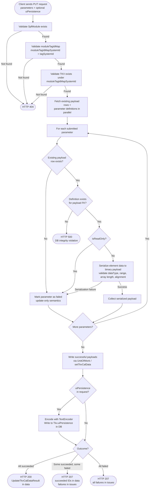

# SPF Module Update TKV Tag Data — Low-Level Design

## Table of Contents

- [Overview](#overview)
- [Section 1: Architecture & Call Flow](#section-1-architecture--call-flow)
  - [1.1 High-Level Workflow Diagram](#11-high-level-workflow-diagram)
  - [1.2 File and Folder Organization](#12-file-and-folder-organization)
  - [1.3 Layer Responsibilities](#13-layer-responsibilities)
- [Section 2: Presentation Layer](#section-2-presentation-layer)
  - [2.1 Controller — updateTagData](#21-controller--updatetagdata)
  - [2.2 DTO Changes — UpdateTkvRequestDto](#22-dto-changes--updatetkvrequestdto)
  - [2.3 Response Assembly](#23-response-assembly)
- [Section 3: Core Layer](#section-3-core-layer)
  - [3.1 UpdateTkvCalDataCommand](#31-updatetkvcaldatacommand)
  - [3.2 UpdateTkvCalDataHandler](#32-updatetkvcaldatahandler)
  - [3.3 ModuleRepository Extensions](#33-modulerepository-extensions)
  - [3.4 Binary Parameter Serializer (existing — reused)](#34-binary-parameter-serializer-existing--reused)
- [Section 4: Infrastructure Layer](#section-4-infrastructure-layer)
  - [4.1 TypeOrmModuleRepository — TKV Cal Data Methods](#41-typeormmodulerepository--tkv-cal-data-methods)
  - [4.2 UnitOfWork Wiring](#42-unitofwork-wiring)
- [Section 5: Testing Strategy](#section-5-testing-strategy)
  - [Unit Tests](#unit-tests)
  - [Integration Tests](#integration-tests)
  - [End-to-End Tests](#end-to-end-tests)

---

## Overview

This document describes the design of the RESTful PUT endpoint for updating SPF module TKV tag data.
It is the TKV counterpart of `spf-module-update-ckv-calibration-design.md` — the same CQRS command pattern,
per-parameter serialization, UnitOfWork transaction, and `PartialSuccessInterceptor` apply.
The key differences are the extra `tagSystemId` path parameter and the two-step TKV validation
(`moduleTagIdMapExists` before `tkvExists`) in place of the single CKV check.

**Endpoint:** `PUT /arc-api/v1/projects/{projectId}/spf-modules/{spfModuleSystemId}/tag-data/{tagSystemId}/{tkvSystemId}`

**Reference design:** `docs/spf-module-update-ckv-calibration-design.md` — identical patterns apply unless stated otherwise.

---

## Section 1: Architecture & Call Flow

The write path is the symmetric counterpart to `getTagData`, following the same hexagonal + CQRS structure.
Because this endpoint **writes** to the database, it uses a **Command + CommandBus + UnitOfWork** instead of a Query + QueryBus + QueryServices.

### 1.1 High-Level Workflow Diagram



### 1.2 File and Folder Organization

#### Presentation Layer Files

```
packages/api/src/presentation/rest/modules/spf-module/
├── spf-module.controller.ts                           (existing — updateTagData implemented)
└── dto/request/
    └── update-tkv-request.dto.ts                     (existing — modified: data→parameters, add uiPersistence)
```

#### Core Layer Files

```
packages/core/src/application/
├── ports/persistence/repositories/module/
│   └── module.repository.ts                          (modified — add 4 TKV methods)
└── usecase-designer/spf-module/
    └── update-tag-data/
        ├── update-tkv-cal-data.command.ts               (new — UpdateTkvCalDataCommand)
        ├── update-tkv-cal-data.handler.ts               (new — UpdateTkvCalDataHandler)
        └── update-tkv-cal-data-result.ts                (new — UpdateTkvCalDataResult type)
```

**Command handler registration:**
```
packages/core/src/application/orchestration/cqrs/registries/
└── command-handler-registry.ts                       (modified — register UpdateTkvCalDataHandler)
```

#### Infrastructure Layer Files

```
packages/infrastructure/persistence/src/persistence-typeorm-sqllite/
└── repositories/
    └── typeorm-module.repository.ts                  (modified — implement 4 new TKV methods)
```

### 1.3 Layer Responsibilities

| Layer | Responsibility |
|---|---|
| **Presentation** | Route mapping, DTO validation/parsing, dispatch command, map result to HTTP response |
| **Core** | Validation checks, per-parameter serialization, UnitOfWork write orchestration |
| **Infrastructure** | Database reads (existence checks, payload fetch, definition fetch), database writes (payload rows + `Tkv.uiPersistence`) |

---

## Section 2: Presentation Layer

### 2.1 Controller — `updateTagData`

**File:** `packages/api/src/presentation/rest/modules/spf-module/spf-module.controller.ts` (existing — implement `updateTagData`)

The stub already exists. Implementation mirrors `updateCalibrationData` exactly:
- Constructs `UpdateTkvCalDataCommand(projectId, spfModuleSystemId, tagSystemId, tkvSystemId, clientId, parameters, uiPersistence)`
- Dispatches via `commandBus.execute(command)`
- Returns `toApiResult(result)`

```typescript
@Put('/:spfModuleSystemId/tag-data/:tagSystemId/:tkvSystemId')
async updateTagData(
  @Param('projectId') projectId: string,
  @Param('spfModuleSystemId') spfModuleSystemId: string,
  @Param('tagSystemId') tagSystemId: string,
  @Param('tkvSystemId') tkvSystemId: string,
  @Body() body: UpdateTkvRequestDto,
): Promise<ApiResult<UpdateTkvCalDataResponseDto>> {
  const clientId = 'client-id'; // TODO: extract from JWT
  const command = new UpdateTkvCalDataCommand(
    projectId, spfModuleSystemId, tagSystemId, tkvSystemId,
    clientId, body.parameters, body.uiPersistence,
  );
  const result = await this.commandBus.execute<Result<UpdateTkvCalDataResult>>(command);
  return toApiResult(result);
}
```

### 2.2 DTO Changes — `UpdateTkvRequestDto`

**File:** `packages/api/src/presentation/rest/modules/spf-module/dto/request/update-tkv-request.dto.ts` (modified)

Current shape:
```typescript
export class UpdateTkvRequestDto {
  data!: ParameterSummaryDto[];
}
```

New shape — aligned with the CKV `UpdateSpfModuleCalDataRequestDto`:
```typescript
import {ParameterDto} from '../response/parameter.dto.js';

export class UpdateTkvRequestDto {
  /** Parameter payloads to update, identified by their payload system IDs. */
  parameters!: ParameterDto[];

  /**
   * Optional UI persistence blob (UTF-8 text).
   * Written to Tkv.uiPersistence when present; left unchanged when absent.
   */
  uiPersistence?: string;
}
```

`ParameterDto` is the same type used by `UpdateSpfModuleCalDataRequestDto` — it contains `systemId` and `elements`.

### 2.3 Response Assembly

Response type: `ApiResult<UpdateTkvCalDataResult>`

`UpdateTkvCalDataResult`:
```typescript
export interface UpdateTkvCalDataResult {
  groupId: string;
  succeededParamSystemIds: number[];
}
```

`PartialSuccessInterceptor` converts `Result.partial(...)` to HTTP 207, `Result.ok(...)` to HTTP 200 — unchanged from CKV.

---

## Section 3: Core Layer

### 3.1 `UpdateTkvCalDataCommand`

**File:** `packages/core/src/application/usecase-designer/spf-module/update-tag-data/update-tkv-cal-data.command.ts` (new)

Mirrors `PutCkvCalDataCommand`, with `tagSystemId` (= `moduleTagIdMapSystemId`) added:

```typescript
export class UpdateTkvCalDataCommand extends BaseCommand {
  public readonly projectId: number;
  public readonly spfModuleSystemId: number;
  /** moduleTagIdMapSystemId — PK of module_tag_id_map row. */
  public readonly tagSystemId: number;
  public readonly tkvSystemId: number;
  public readonly parameters: Array<{systemId: number; elements: ParameterElementDto[]}>;
  public readonly uiPersistence?: string;

  constructor(
    projectIdStr: string,
    spfModuleSystemIdStr: string,
    tagSystemIdStr: string,
    tkvSystemIdStr: string,
    clientId: string,
    parameters: Array<{systemId: number; elements: ParameterElementDto[]}>,
    uiPersistence?: string,
  ) {
    super(clientId);
    this.projectId           = parseId(projectIdStr, 'projectId');
    this.spfModuleSystemId   = parseId(spfModuleSystemIdStr, 'spfModuleSystemId');
    this.tagSystemId         = parseId(tagSystemIdStr, 'tagSystemId');
    this.tkvSystemId         = parseId(tkvSystemIdStr, 'tkvSystemId');
    this.parameters          = parameters;
    this.uiPersistence       = uiPersistence;
  }
}
```

### 3.2 `UpdateTkvCalDataHandler`

**File:** `packages/core/src/application/usecase-designer/spf-module/update-tag-data/update-tkv-cal-data.handler.ts` (new)

Structurally identical to `PutCkvCalDataHandler`. The differences are:

1. **Two-step TKV validation** (Step 2a + 2b) instead of the single `ckvExists` check.
2. Uses `moduleRepo.moduleTagIdMapExists(spfModuleSystemId, tagSystemId)` — new method.
3. Uses `moduleRepo.tkvExists(tagSystemId, tkvSystemId)` — new method.
4. Uses `moduleRepo.getExistingTkvPayloads(tkvSystemId)` instead of `getExistingCkvPayloads`.
5. Uses `moduleRepo.setTkvCalData(tagSystemId, tkvSystemId, writeBatch, uiPersistence)` instead of `setCkvCalData`.

```typescript
export class UpdateTkvCalDataHandler {
  constructor(
    private readonly uow: UnitOfWork,
    private readonly logger?: Logger,
  ) {}

  async handle(command: UpdateTkvCalDataCommand): Promise<Result<UpdateTkvCalDataResult>> {
    const {session, groupId} = this.uow.getWriteContext();
    const fileSystemId = session.fileSystemId;
    const moduleRepo = this.uow.getModuleRepository();

    // Step 1: validate SpfModule exists
    const spfModule = await moduleRepo.getSpfModuleForValidation(
      command.spfModuleSystemId, fileSystemId,
    );
    if (!spfModule) throw new ResourceNotFoundException('SpfModule not found');

    // Step 2a: validate tag map exists under this SpfModule
    const tagMapExists = await moduleRepo.moduleTagIdMapExists(
      command.spfModuleSystemId, command.tagSystemId,
    );
    if (!tagMapExists) throw new ResourceNotFoundException('Tag (moduleTagIdMap) not found');

    // Step 2b: validate TKV exists under this tag map
    const tkvExists = await moduleRepo.tkvExists(command.tagSystemId, command.tkvSystemId);
    if (!tkvExists) throw new ResourceNotFoundException('TKV not found');

    // Step 3: fetch existing payloads + parameter definitions
    const existingPayloads = await moduleRepo.getExistingTkvPayloads(
      command.tagSystemId, command.tkvSystemId,
    );
    const relevantParamSystemIds = existingPayloads.map(p => p.parameterSystemId);
    const definitions = await this.uow.getModuleDefinitionRepository()
      .getParameterDefinitions(spfModule.definitionSystemId, relevantParamSystemIds);

    // Step 4: per-parameter validation + serialization (same logic as CKV handler)
    const payloadMap = new Map(existingPayloads.map(p => [p.systemId, p]));
    const defMap     = new Map(definitions.map(d => [d.systemId, d]));
    const issues: Issue[] = [];
    const succeededParamSystemIds: number[] = [];
    const writeBatch: Array<{payloadSystemId: number; payload: Uint8Array}> = [];

    for (const param of command.parameters) {
      const result = this.processParam(param, payloadMap, defMap);
      if (!result.ok) { issues.push(result.issue); continue; }
      succeededParamSystemIds.push(result.payloadSystemId);
      writeBatch.push({payloadSystemId: result.payloadSystemId, payload: result.payload});
    }

    // Step 5: write
    await this.uow.startTransaction();
    try {
      await moduleRepo.setTkvCalData(
        command.tagSystemId, command.tkvSystemId, writeBatch, command.uiPersistence,
      );
      await this.uow.commit();
    } catch (error) {
      if (this.uow.isInTransaction()) await this.uow.rollback();
      throw new Error(
        `Tag data write failed — transaction rolled back, no parameters were updated. Cause: ${(error as Error).message}`,
      );
    }

    const data: UpdateTkvCalDataResult = {groupId, succeededParamSystemIds};
    return issues.length > 0 ? Result.partial(data, issues) : Result.ok(data);
  }

  // Identical to PutCkvCalDataHandler.processParam — same validation rules
  private processParam(
    param: {systemId: number; elements: ParameterElementDto[]},
    payloadMap: Map<number, ExistingPayloadRow>,
    defMap: Map<number, ParameterDefinitionBase>,
  ): ParamProcessResult { /* same implementation as CKV */ }
}
```

> **Note:** `processParam` is identical to `PutCkvCalDataHandler.processParam`. Consider extracting it to `spf-module/shared/` only if a third consumer arises — do not extract speculatively.

### 3.3 `ModuleRepository` Extensions

**File:** `packages/core/src/application/ports/persistence/repositories/module/module.repository.ts` (modified)

Add four new TKV methods to the `ModuleRepository` interface, mirroring the four CKV methods:

| New method | CKV counterpart | Description |
|---|---|---|
| `moduleTagIdMapExists(spfModuleSystemId, moduleTagIdMapSystemId)` | _(no CKV equivalent — TKV-specific)_ | Returns `true` if the `module_tag_id_map` row exists under the given SpfModule, respecting session overlay (pending CREATE = exists, pending DELETE = not exists) |
| `tkvExists(moduleTagIdMapSystemId, tkvSystemId)` | `ckvExists(spfModuleSystemId, ckvSystemId)` | Returns `true` if the TKV row exists under the given tag map, respecting session overlay |
| `getExistingTkvPayloads(moduleTagIdMapSystemId, tkvSystemId)` | `getExistingCkvPayloads(spfModuleSystemId, ckvSystemId)` | Returns all `tkv_parameter_payload` rows under the TKV, respecting session overlay |
| `setTkvCalData(moduleTagIdMapSystemId, tkvSystemId, writeBatch, uiPersistence?)` | `setCkvCalData(spfModuleSystemId, ckvSystemId, writeBatch, uiPersistence?)` | Writes the serialized payload batch and optionally updates `Tkv.uiPersistence` |

Interface additions:
```typescript
export interface ModuleRepository {
  // ... existing methods unchanged ...

  /**
   * Returns true if a module_tag_id_map row with the given systemId
   * exists under the given SpfModule in the effective (session-overlaid) state.
   */
  moduleTagIdMapExists(spfModuleSystemId: number, moduleTagIdMapSystemId: number): Promise<boolean>;

  /**
   * Returns true if a tkv row with the given systemId exists under
   * the given module_tag_id_map in the effective state.
   */
  tkvExists(moduleTagIdMapSystemId: number, tkvSystemId: number): Promise<boolean>;

  /**
   * Returns all tkv_parameter_payload rows under the given TKV
   * in the effective (session-overlaid) state.
   */
  getExistingTkvPayloads(
    moduleTagIdMapSystemId: number,
    tkvSystemId: number,
  ): Promise<ExistingPayloadRow[]>;

  /**
   * Writes the payload batch to tkv_parameter_payload rows.
   * If uiPersistence is present, encodes it (TextEncoder) and writes
   * it to Tkv.uiPersistence.
   * Called within an active UnitOfWork transaction.
   */
  setTkvCalData(
    moduleTagIdMapSystemId: number,
    tkvSystemId: number,
    writeBatch: Array<{payloadSystemId: number; payload: Uint8Array}>,
    uiPersistence?: string,
  ): Promise<void>;
}
```

`ExistingPayloadRow` is the same type already used by CKV:
```typescript
export interface ExistingPayloadRow {
  systemId: number;       // tkv_parameter_payload.system_id (PK)
  parameterSystemId: number;  // tkv_parameter_payload.parameter_system_id (FK)
}
```

### 3.4 Binary Parameter Serializer (existing — reused)

`serializeParameterData`, `BinaryDataWriter`, and `mapDtoToParameterCalibration` are unchanged.
The TKV handler calls them identically to the CKV handler.
See `spf-module-update-ckv-calibration-design.md` § 3.4 for the full serialization specification,
including: dataType mapping, range validation, float32 precision, Int64/UInt64 bigint handling,
dynamic array length validation, struct 4-byte alignment, and parameter 8-byte alignment.

---

## Section 4: Infrastructure Layer

### 4.1 `TypeOrmModuleRepository` — TKV Cal Data Methods

**File:** `packages/infrastructure/persistence/src/persistence-typeorm-sqllite/repositories/typeorm-module.repository.ts` (modified)

Implement the four new `ModuleRepository` TKV methods:

#### `moduleTagIdMapExists`

```typescript
async moduleTagIdMapExists(
  spfModuleSystemId: number,
  moduleTagIdMapSystemId: number,
): Promise<boolean> {
  // Check session overlay first (pending CREATE/DELETE)
  if (this.session) {
    const actions = await this.editActionsSvc.getByAggregateId(
      this.session.sessionId, spfModuleSystemId, ENTITY_NAMES.ModuleTagIdMap,
    );
    const createAction = actions.find(
      a => a.operation === CHANGE_OPERATION.Create && a.targetSystemId === moduleTagIdMapSystemId,
    );
    if (createAction) return true;
    const deleteAction = actions.find(
      a => a.operation === CHANGE_OPERATION.Delete && a.targetSystemId === moduleTagIdMapSystemId,
    );
    if (deleteAction) return false;
  }
  const count = await this.manager
    .getRepository(ENTITY_NAMES.ModuleTagIdMap)
    .count({where: {systemId: moduleTagIdMapSystemId, spfModuleSystemId}});
  return count > 0;
}
```

#### `tkvExists`

Mirrors `ckvExists`. Checks session overlay (aggregateId = `moduleTagIdMapSystemId` for TKV), then falls back to DB count.

```typescript
async tkvExists(moduleTagIdMapSystemId: number, tkvSystemId: number): Promise<boolean> {
  if (this.session) {
    const actions = await this.editActionsSvc.getByAggregateId(
      this.session.sessionId, moduleTagIdMapSystemId, ENTITY_NAMES.Tkv,
    );
    if (actions.some(a => a.operation === CHANGE_OPERATION.Create && a.targetSystemId === tkvSystemId)) return true;
    if (actions.some(a => a.operation === CHANGE_OPERATION.Delete && a.targetSystemId === tkvSystemId)) return false;
  }
  const count = await this.manager
    .getRepository(ENTITY_NAMES.Tkv)
    .count({where: {systemId: tkvSystemId, moduleTagIdMapSystemId}});
  return count > 0;
}
```

#### `getExistingTkvPayloads`

Mirrors `getExistingCkvPayloads`. Uses `TkvOverlayFetcher.fetchTkvPayloads` to get the session-effective payload list, then maps to `ExistingPayloadRow[]`:

```typescript
async getExistingTkvPayloads(
  moduleTagIdMapSystemId: number,
  tkvSystemId: number,
): Promise<ExistingPayloadRow[]> {
  const sessionId = this.session?.sessionId ?? null;
  const overlaid = await this.tkvFetcher.fetchTkvPayloads(tkvSystemId, sessionId);
  return overlaid.map(p => ({systemId: p.systemId, parameterSystemId: p.parameterSystemId}));
}
```

`this.tkvFetcher` is a `TkvOverlayFetcher` instance injected into the repository.

#### `setTkvCalData`

Mirrors `setCkvCalData`. Updates `tkv_parameter_payload.payload` for each row in `writeBatch`, and optionally updates `tkv.ui_persistence`:

```typescript
async setTkvCalData(
  moduleTagIdMapSystemId: number,
  tkvSystemId: number,
  writeBatch: Array<{payloadSystemId: number; payload: Uint8Array}>,
  uiPersistence?: string,
): Promise<void> {
  for (const {payloadSystemId, payload} of writeBatch) {
    await this.manager
      .getRepository(ENTITY_NAMES.TkvParameterPayload)
      .update({systemId: payloadSystemId, tkvSystemId}, {payload});
  }
  if (uiPersistence !== undefined) {
    const encoded = new TextEncoder().encode(uiPersistence);
    await this.manager
      .getRepository(ENTITY_NAMES.Tkv)
      .update({systemId: tkvSystemId, moduleTagIdMapSystemId}, {uiPersistence: encoded});
  }
}
```

**Aggregate IDs for session write tracking:**

When `setTkvCalData` is called within a UnitOfWork transaction, the `edit_actions` rows written use:
- `tkv_parameter_payload` updates: `aggregateId` determined by UnitOfWork pattern (same as CKV payloads)
- `tkv` updates (uiPersistence): `aggregateId = moduleTagIdMapSystemId`

This is consistent with how `TkvOverlayFetcher.fetchForModule` and `fetchTkvPayloads` look up overlay actions.

### 4.2 UnitOfWork Wiring

`TkvOverlayFetcher` is injected into `TypeOrmModuleRepository` at the same wiring site where `CkvOverlayFetcher` is already wired:

```
packages/infrastructure/persistence/src/persistence-typeorm-sqllite/
└── repositories/typeorm-module.repository.ts  (constructor receives TkvOverlayFetcher)
```

No new infrastructure modules need to be registered — the repository already participates in the UnitOfWork pattern.

---

## Section 5: Testing Strategy

### Unit Tests

#### `UpdateTkvCalDataHandler`

**Location:** `packages/core/tests/unit/application/usecase-designer/spf-module/update-tag-data/`

Mock `uow` (UnitOfWork), `getModuleRepository()`, and `getModuleDefinitionRepository()`.

| Test case | Expected outcome |
|---|---|
| All params succeed, no `uiPersistence` | `Result.ok({groupId, succeededParamSystemIds})` |
| All params succeed, with `uiPersistence` | `setTkvCalData` called with encoded bytes |
| One param fails (not found in existingPayloads) | `Result.partial` with `PARAM_PAYLOAD_NOT_FOUND` issue |
| One param fails (isReadOnly) | `Result.partial` with `PARAM_READ_ONLY` issue |
| One param fails (serialization error) | `Result.partial` with `PARAM_SERIALIZATION_FAILED` issue |
| All params fail | `Result.partial` with all failures, `succeededParamSystemIds: []` |
| SpfModule not found | Throws `ResourceNotFoundException('SpfModule not found')` |
| Tag map not found | Throws `ResourceNotFoundException('Tag (moduleTagIdMap) not found')` |
| TKV not found | Throws `ResourceNotFoundException('TKV not found')` |
| Definition missing for existing payload FK | Throws `Error` (DB integrity violation) |
| Transaction failure | Throws `Error('Tag data write failed — transaction rolled back...')` |

#### `processParam` (private — tested via handler)

| Test case | Assertion |
|---|---|
| Valid param, writable | Returns `{ok: true, payload: Uint8Array}` |
| `systemId` not in payloadMap | Returns `{ok: false, issue: PARAM_PAYLOAD_NOT_FOUND}` |
| `isReadOnly: true` | Returns `{ok: false, issue: PARAM_READ_ONLY}` |
| Serialization failure | Returns `{ok: false, issue: PARAM_SERIALIZATION_FAILED}` |

### Integration Tests

#### `TypeOrmModuleRepository` — new TKV methods

**Location:** `packages/infrastructure/persistence/tests/integration/repositories/`

##### `moduleTagIdMapExists`

| Test case | Expected |
|---|---|
| Row in DB, matching `spfModuleSystemId` | `true` |
| Row in DB, wrong `spfModuleSystemId` | `false` |
| Row not in DB | `false` |
| Session CREATE action for this systemId | `true` (before DB commit) |
| Session DELETE action for this systemId | `false` (logical delete) |

##### `tkvExists`

| Test case | Expected |
|---|---|
| TKV in DB under correct `moduleTagIdMapSystemId` | `true` |
| TKV in DB under wrong `moduleTagIdMapSystemId` | `false` |
| TKV not in DB | `false` |
| Session CREATE action (aggregateId = `moduleTagIdMapSystemId`) | `true` |
| Session DELETE action | `false` |

##### `getExistingTkvPayloads`

| Test case | Expected |
|---|---|
| 3 payloads in DB | Returns 3 `ExistingPayloadRow` entries |
| No payloads in DB | Returns `[]` |
| Session CREATE action adds a payload | Row included in result |
| Session DELETE action removes a payload | Row excluded from result |

##### `setTkvCalData`

| Test case | Expected |
|---|---|
| Write single payload | `tkv_parameter_payload.payload` updated |
| Write multiple payloads atomically | All rows updated |
| `uiPersistence` present | `tkv.ui_persistence` updated with UTF-8 bytes |
| `uiPersistence` absent | `tkv.ui_persistence` unchanged |
| `tkvSystemId` mismatch | Update affects 0 rows (no error; UnitOfWork tracks the delta) |

### End-to-End Tests

**Location:** `packages/api/tests/e2e/modules/spf-module/`
**File:** `update-tkv-data.e2e-spec.ts` (new)

| Test case | HTTP | Description |
|---|---|---|
| All params succeed | 200 | `succeededParamSystemIds` matches submitted count |
| Some params succeed, some fail | 207 | `issues` contains failed param IDs |
| All params fail | 207 | `data.succeededParamSystemIds` is empty |
| `uiPersistence` field present | 200 | `tkv.ui_persistence` updated (verify via GET) |
| `uiPersistence` absent | 200 | `tkv.ui_persistence` unchanged |
| SpfModule not found | 404 | |
| Tag map not found | 404 | `tagSystemId` not under this module |
| TKV not found | 404 | `tkvSystemId` not under this tag map |
| ReadOnly parameter in request | 207 | Param rejected with `PARAM_READ_ONLY` issue |
| Invalid `spfModuleSystemId` format | 400 | |
| Invalid `tagSystemId` format | 400 | |
| Invalid `tkvSystemId` format | 400 | |
| Empty `parameters` array | 200 | `succeededParamSystemIds: []`, no issues |
| Parameter `systemId` not in existing payloads | 207 | `PARAM_PAYLOAD_NOT_FOUND` issue |
